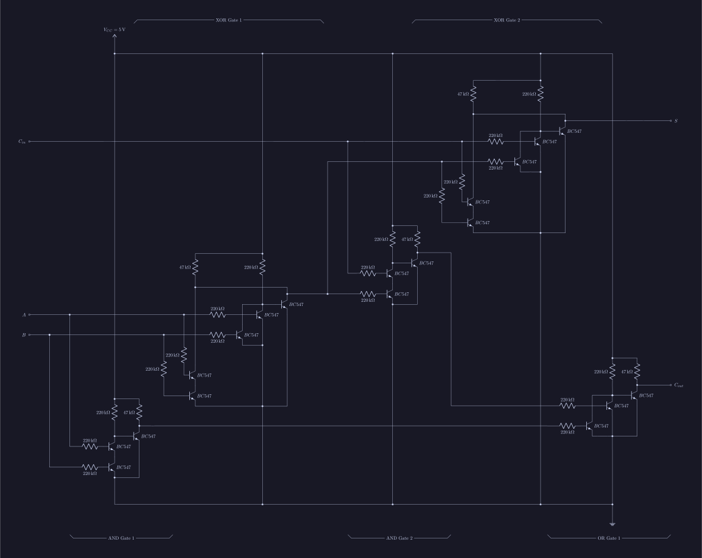

# Four Bit Adder

This repo contains the schematics for a Four Bit Adder made entirely from
transistors and resistors.

# Transistor Level Schematic of a Full Adder

# Building the TeX Files

(DISCLAIMER: only circuit diagrams are finished)

You need [LunaTikZ](https://github.com/thepenguinn/lunatikz), which is TikZ
(ofcourse, every diagram is drawn with TikZ) picture builder (which is my own
creation, btw). Once you have `lunatikz` and its dependencies, you can run
`make` from `docs/` directory. And `make` will **Fail** (Be not Afraid!) before
finish running. If you `ls` in the `docs/` directory, you could see a
`main.pdf` file. That is the doc file. `make` failed because it couldn't find
`viewpdf` in your `$PATH`. (btw, it's just a script that I wrote to open that
pdf.) Use your beloved pdf reader to open that `main.pdf`.

NOTE: You need a local install of texlive (LaTeX) to compile this document.

# Rest of the README

#wip
